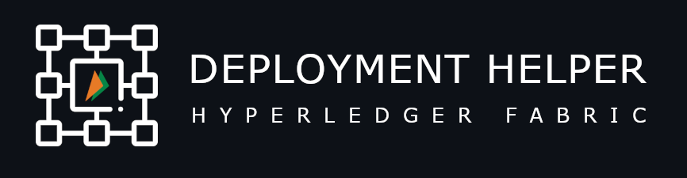

## Hyperledger Fabric Deployment Helper for Kubernetes

 
 

 

The Hyperledger Fabric Deployment Helper for Kubernetes is an open-source project designed to streamline the deployment and management of Hyperledger Fabric based blockchain networks on Kubernetes clusters. This tool simplifies the complex process of setting up, configuring, and maintaining Fabric nodes, peers, orderers, and channels within a Kubernetes environment. With templatised helm charts and customizable configuration options, the project empowers developers and administrators to effortlessly deploy and scale secure and robust Hyperledger Fabric networks, leveraging the flexibility and scalability of Kubernetes orchestration. 

Whether you're a blockchain enthusiast, developer, or enterprise seeking to harness the power of distributed ledger technology using Hyperledger Fabric, the deployment helper for Kubernetes is your go-to solution for efficient, reliable, and automated Fabric network deployment. 

`We are open for contributions, upgrades and features, please feel free to pickup any "good first issues" or propose new features to make the utility more powerful.`

### Features
- [x] CA Management (Root CA, TLS CA & Intermediate CAs)
- [x] Peer Creation
- [x] Orderer Creation
- [x] Channel Management
- [x] Chaincode Lifecycle Management (Install, Approve, Commit and CC Upgrades)
- [x] Cryptographic operations support and certification management
- [x] Domain Name support and SNI Based Routing
- [x] Ingress resource provisioning
- [x] File Registry support for centralised config files
- [x] Support for Hyperledger Fabric 2.3+
- [x] Multi-zone, Multi-DC, Private Network (On-prem DCs) deployment support

### Roadmap
- [ ] Multi-channel support
- [ ] Automatic certificate renewal
- [ ] GUI based deployment support
- [ ] Optional Fabric Explorer
- [ ] Optional Fabric Operations Console
- [ ] Observability stack
- [ ] Key Management using HSM / Vault

### Releases
- v1.0-beta

### Samples
Please refer our [examples](examples/README.md) for running a complete blockchain network using the deployment helper.

### Production Readiness
The Hyperledger Fabric Deployment Helper is utilised across multiple blockchain projects within NPCI.

### Disclaimer
This program is free software: you can redistribute it and/or modify
it under the terms of the GNU General Public License as published by
the Free Software Foundation, either version 3 of the License, or
(at your option) any later version.

This program is distributed in the hope that it will be useful,
but WITHOUT ANY WARRANTY; without even the implied warranty of
MERCHANTABILITY or FITNESS FOR A PARTICULAR PURPOSE.  See the
GNU General Public License for more details.

You should have received a copy of the GNU General Public License
along with this program.  If not, see <https://www.gnu.org/licenses/>.

### License
Hyperledger Fabric Deployment Helper for Kubernetes source code files are made available under the GNU General Public License, Version 3.0 (GPL-3.0), located in the LICENSE file.