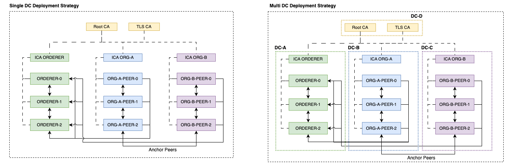
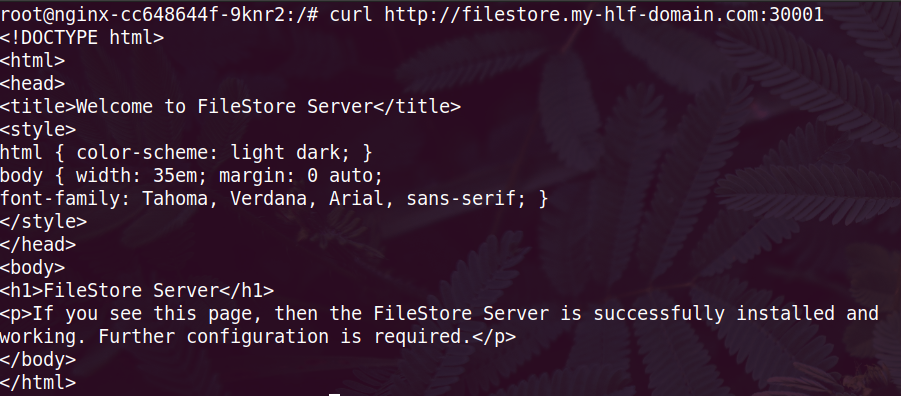
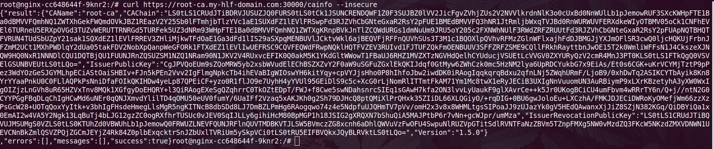
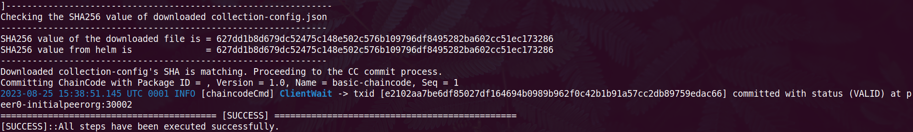

## Falcon : HLF Deployment Helper

### Reference Deployment Strategies
[]() 


#### Prerequisite

[]() 
[]() 
[]() 
[]() 

* Nginx Ingress OR any other K8S ingress that supports ```SNI based routing```. The ingress service should be exposed by two ```Nodeports for Ports: 80/TCP, 443/TCP```. Eg; NodePort 30000 => 443/TCP (Ingress service).
* ```--enable-ssl-passthrough``` Should be enabled on the Nginx Ingress pod. All of the Hyperledger Fabric related TLS requests should be terminated on the Pod level as long as we're keeping the certs in the POD itself. If Nginx, then a similar ssl passthrough annotation ```"nginx.ingress.kubernetes.io/ssl-passthrough: "true"``` must be added to all the HLF Ingress resources we create. This annotation can be handled from the values file for every helm chart. In case if you're not using Nginx Ingress, kindly add the proper annotations accordingly.
* ```Configurable DNS```. You should have the ability to add custom DNS zones that are resolvable from the pods. If you're using CoreDNS, follow this guide to add custom zones on your Kubernetes cluster https://coredns.io/2017/05/08/custom-dns-entries-for-kubernetes/. If deploying to GKE on GCP, you can make use of CloudDNS private zones. 
* Once added the zone, then you need to add A record(s) that points to the server(s) where the Ingress is listening. It must be a wildcard DNS entry.
    Eg, If your domain name is ```my-hlf-domain.com``` and you have 3 worker nodes ```10.10.10.10``` ```10.10.10.11``` ```10.10.10.12```. Then you need to create a DNS entry ```*.my-hlf-domain.com``` to point to above IPs. This is a must have configuration and make sure that wildcard DNS queries are resolving properly. If this fails, the deployment will fail. Kindly make sure this DNS is resolving and the tcp connections are reaching the ingress. You can verify it by simple telnet command. 
    ```telnet anyname.my-hlf-domain.com 30000 ``` assuming that 30000 is the Nodeport on Nginx Ingress that maps to Ingress 443. 
  If you're in any public cloud platform, then hard coding the worker node IP in the DNS is not a reliable approach since the worker node can be changed at any time. In that case, you can deploy an Internal Cloud LB.
* ```StorageClass``` that supports dynamic volume provisioning. 
* We're using the docker hub upstream HyperLedger Fabric images for Fabric CA, Peers, Orderers and a custom builder tool which is hosted on NPCI docker hub registry. Make sure that your worker nodes can pull these images from docker hub. If not, upload them to your internal registry and the registry/repository can be managed over values.


##### Keep in mind the following things throughout this example deployment;

  1. We'll be using the domain `my-hlf-domain.com`. If you have created a different domain as specified in the pre-req section, then update the `my-hlf-domain.com` to your domain name wherever there is a mention. 
  2. The Ingress classname is `nginx`. You need to change it to the appropriate value on your environment if you have a different one.
  3. Nginx ingress services are exposed on `30000` and `30001` for `https` and `http` nodeports respectively.
  4. StorageClass we use `standard-rwo`. Feel free to to change it to your storageclass.
  5. project : `yourproject`. 
  6. If you're using the domain `my-hlf-domain.com`, `nginx` inrgessclass, `30000` and `30001` Nodeports for your Nginx Ingress services, then ideally you don't need to make any changes in any of the values files. Just follow the rest of the deployment guide and apply the following helm commands. Your network will be up and running.

### Let's get started.

1. **Deploy a Filestore server.**

Clone this repository and change your directory to the root directory. First you need to deploy a Filestore server. This is where the helper uploads some of the common artifacts like blockfiles, chain code package, collection config etc. Its basically an Nginx deployment with custom nginx rules to support file uploading over curl. 

  ```
  # helm install filestore -n filestore helm-charts/filestore/ -f examples/filestore/values.yaml --create-namespace
  ```
Create a folder at root with name: test 

Create the Persistent Volume for the PVC to attach
```
kubectl apply -f examples/filestore/pv.yaml
```
  
  If you have your own domain, image and ingress class. Then update the below mentioned values in the [examples/filestore/values.yaml](./filestore/values.yaml).
  - image
  - global.hlf_domain
  - ingress.className

  Once deployed, you will see the resources and an ingress with hostname `filestore.my-hlf-domain.com`. This will be your filestore end point. Exec into any of your running pods in the same cluster and check with a curl request to make sure that everything is working as expected. 

  ```
  curl http://filestore.my-hlf-domain.com:30001
  ```
  If you're getting the following response then that means your Ingress, Custom DNS etc are working properly.

[]()


#### Deploy ROOTCA,TLSCA & InitialpeerOrg environments

2. **Deploy ROOT CA**

Create a kubernetes secret with ```user``` and ```password``` as keys for this `ROOTCA` server. We kept this secret out of the helm charts/values to get more security. All CA/ICA/TLSCA server username/password are handled in this way. Change the ```namespace``` & ```secret``` name if you need a different one and update the secret name at `ca_server.admin_secret`
```
# kubectl create ns orderer
# kubectl -n orderer create secret generic rca-secret --from-literal=user=rca-admin --from-literal=password=rcaComplexPassword
```
  
Apply the `fabric-ca` chart with our values file. If you change the ```tls_domain, docker images, secret & storageClass``` then update the [examples/fabric-ca/root-ca.yaml](./fabric-ca/root-ca.yaml) accordingly.
```
# helm install root-ca -n orderer helm-charts/fabric-ca -f examples/fabric-ca/root-ca.yaml
```
This will deploy the `root-ca` server for you and the server will be available at `https://root-ca.my-hlf-domain.com`. To verify the server, you can get into any running pod in the cluster and send a curl request as below;
```
curl https://root-ca.my-hlf-domain.com:30000/cainfo --insecure
```
You will get the CA response like below.

[]()

3. **Deploy TLSCA**

Create an another kubernetes secret for your `TLSCA` server just like we did it for `ROOTCA` and update the secret name in the values file `examples/fabric-ca/tls-ca.yaml`. If you change the ```tls_domain, docker images, secret & storageClass``` then update the [examples/fabric-ca/tls-ca.yaml](./fabric-ca/tls-ca.yaml) accordingly.
```
# helm install tls-ca -n orderer helm-charts/fabric-ca -f examples/fabric-ca/tls-ca.yaml
```
You can verify it with the similar way we verified the root-ca end-point above.

4. **Create ROOTCA identities**
* Note:- Every identity registration job must be executed in the same namespace where the respective CA's are running. And the admin credentials secret name must be supplied to the values file at `Values.ca.admin_secret`
```
# helm install rootca-ops -n orderer helm-charts/fabric-ops/ -f examples/fabric-ops/rootca/rootca-identities.yaml
```
5. **Create TLSCA identities**
```
# helm install tlsca-ops -n orderer helm-charts/fabric-ops/ -f examples/fabric-ops/tlsca/tlsca-identities.yaml
```
6. **Deploy Orderer ICA**

Here, we're deplyoing the same Fabric-ca charts for this CA but this will be in ICA mode. This time you need to create the kubernetes secret with the username and password that you registered at ROOTCA identities job. If you have changed that identities then, create the secret with those values and update the secret name here [examples/fabric-ca/ica-orderer.yaml](./fabric-ca/ica-orderer.yaml) with your secret. If you have not touched anything, then simply apply the following.
```
# helm install ica-orderer -n orderer helm-charts/fabric-ca -f examples/fabric-ca/ica-orderer.yaml
```
7. **Deploy Initial peer org ICA**

Follow the same ICA Orderer deployment steps here and update [examples/fabric-ca/ica-initialpeerorg.yaml](./fabric-ca/ica-initialpeerorg.yaml) with your secret if you have created the secret with a different name. If you have not touched anything, then simply apply the following.
```
# helm install ica-initialpeerorg -n initialpeerorg helm-charts/fabric-ca -f examples/fabric-ca/ica-initialpeerorg.yaml 
```
8. **Create Orderer identities with ica-orderer**
```
# helm install orderer-ops -n orderer helm-charts/fabric-ops/ -f examples/fabric-ops/orderer/orderer-identities.yaml
```
9. **Create Initialpeerorg identities with ica-initialpeerorg**
```
# helm install initialpeerorg-ops -n initialpeerorg helm-charts/fabric-ops/ -f examples/fabric-ops/initialpeerorg/identities.yaml
```
10. **Generate Genesisblock & Channel transaction file**
```
# helm install cryptogen -n orderer helm-charts/fabric-ops/ -f examples/fabric-ops/orderer/orderer-cryptogen.yaml
```
After successful completion of this `cryptogen Job`, you'll see the `Genesisblock` file and `Channel transaction` file in your filestore under your project directory. If your project name is `yourproject`, then your project directory will be created as `/usr/share/nginx/html/yourproject`.

11. **Deploy Orderers**
```
# helm install orderer -n orderer helm-charts/fabric-orderer/ -f examples/fabric-orderer/orderer.yaml
```
12. **Deploy Peers on Initial peer org**
```
# helm install peer -n initialpeerorg helm-charts/fabric-peer/ -f examples/fabric-peer/initialpeerorg/values.yaml
```
After successful deployment of the Peers, you will get 3 peers in initialpeerorg namespace. Each of these peers will have 1 Init container and 3 app containers `(Fabric Peer, Dind & CouchDB)`. If everything went fine, then you'll see some successful connectivity logs in the `peer0-initialpeerorg-0`.   

13. **Create channel**
```
# helm install channelcreate -n initialpeerorg helm-charts/fabric-ops/ -f examples/fabric-ops/initialpeerorg/channel-create.yaml
```

14. **Update Anchor peers of Initial peer org** 
```
# helm install updateanchorpeer -n initialpeerorg helm-charts/fabric-ops/ -f examples/fabric-ops/initialpeerorg/update-anchor-peer.yaml
```

**Important** :- Before you install chaincode , you need to upload the packaged chaincode  file to the filestore under your project directory. If you don't have any chaincode, you can upload the sample chaincode from our repository `examples/files/basic-chaincode_go_1.0.tar.gz` to `/usr/share/nginx/html/yourproject` path in the filestore server.

If you have your own chaincode, then package it and upload the same to filestore and change the chaincode filename in the [examples/fabric-ops/initialpeerorg/install-chaincode.yaml](./fabric-ops/initialpeerorg/install-chaincode.yaml) values file. This must be changed in all Org's `install-chaincode.yaml` values as well `Values.cc_tar_file`.

15. **Install chaincode on Initialpeerorg Peers**
```
# helm install installchaincode -n initialpeerorg helm-charts/fabric-ops/ -f examples/fabric-ops/initialpeerorg/install-chaincode.yaml
```


### **Deploy Org1 environment**

1. **Deploy Org1 ICA**

You need to create a kubernetes secret with the one registered with rootca identities registration job and update [examples/fabric-ca/ica-org1.yaml](./fabric-ca/ica-org1.yaml) if you're creating a different secret name. Or create the secret mentioned in this file if you do not want to change it. Once done, apply the following.
```
# helm install ica-org1 -n org1 helm-charts/fabric-ca -f examples/fabric-ca/ica-org1.yaml
```
2. **Add Org1 to the network**

Once the `Org1` ICA started successfully, you would need to add this `Org1` to the network. For that, you need to run the following Job in `initialpeerorg`. Comment out the `org2` section from the `Values.organizatons` array in the values file [examples/fabric-ops/initialpeerorg/configure-org-channel.yaml](./fabric-ops/initialpeerorg/configure-org-channel.yaml) for now since we have not deployed the `Org2` yet.
```
# helm install configorgchannel -n initialpeerorg helm-charts/fabric-ops/ -f examples/fabric-ops/initialpeerorg/configure-org-channel.yaml
```
3. **Create Org1 identities with ica-org1**
```
# helm install org1-ca-ops -n org1 helm-charts/fabric-ops/ -f examples/fabric-ops/org1/identities.yaml 
```
4. **Deploy Peers on Org1**
```
# helm install peer -n org1 helm-charts/fabric-peer/ -f examples/fabric-peer/org1/values.yaml
```
5. **Install ChainCode on Org1 Peers.**
```
# helm install installchaincode -n org1 helm-charts/fabric-ops/ -f examples/fabric-ops/org1/install-chaincode.yaml
```
6. **Update Anchor peers of Org1**
```
# helm install updateanchorpeer -n org1 helm-charts/fabric-ops/ -f examples/fabric-ops/org1/update-anchor-peer.yaml
```

### **Deploy Org2 environment**

1. **Deploy Org2 ICA**

You need to create a kubernetes secret with the one registered with rootca identities registration job and update [examples/fabric-ca/ica-org2.yaml](./fabric-ca/ica-org2.yaml) if you're creating a different secret name. Or create the secret mentioned in this file if you do not want to change it. Once done, apply the following.
```
# helm install ica-org2 -n org2 helm-charts/fabric-ca -f examples/fabric-ca/ica-org2.yaml
```
2. **Add Org2 to network**

Once the `Org2` ICA started successfully, you would need to add this `Org2` to the network. For that, you need to upgrade the following `configorgchannel` Job in `initialpeerorg`. This time, uncomment the `org2` section in the `Values.organizatons` array in the values file [examples/fabric-ops/initialpeerorg/configure-org-channel.yaml](./fabric-ops/initialpeerorg/configure-org-channel.yaml).
```
# helm upgrade configorgchannel -n initialpeerorg helm-charts/fabric-ops/ -f examples/fabric-ops/initialpeerorg/configure-org-channel.yaml
```
3. **Create Org1 identities with ica-org1.**
```
# helm install org2-ca-ops -n org2 helm-charts/fabric-ops/ -f examples/fabric-ops/org2/identities.yaml 
```
4. **Deploy Peers on Org2**
```
# helm install peer -n org2 helm-charts/fabric-peer/ -f examples/fabric-peer/org2/values.yaml
```
5. **Install ChainCode on Org2 Peers**
```
# helm install installchaincode -n org2 helm-charts/fabric-ops/ -f examples/fabric-ops/org2/install-chaincode.yaml
```
6. **Update Anchor peers of Org2**
```
# helm install updateanchorpeer -n org2 helm-charts/fabric-ops/ -f examples/fabric-ops/org2/update-anchor-peer.yaml
```

### Approve & Commit Chain Code

 `Approve & Commit requires` **`collection-config`** `optionally. You can manage it through the variable` **`require_collection_config: "true"`**. `If you make it as true, then you must upload a collection config file to the filestore under your project directory. Don't worry, if you have not made any change in the example deployment till this point then you can use the sample collection config we added` [examples/files/collection-config.json](./files/collection-config.json)

 **Important** :- For additional validation, we have added the uploaded collection config `sha256sum` value in the values files of the approval & commit job. These jobs will fail if the `sha256sum` value of the downloaded `collection-config` and the one provided in the values files are different. So if you're changing the `collection-config`, then kindly update the `sha256sum` value under `Values.collection_config_file_hash`.

1. **Approve ChainCode on Initialpeerorg**

 Ensure that you have updated the Chaincode package ID in [examples/fabric-ops/initialpeerorg/approve-chaincode.yaml](./fabric-ops/initialpeerorg/approve-chaincode.yaml), below are the required fields for updating with your own chaincode details. (This Chaincode package ID update is only required if you use your own chaincode package. If not, simply apply the following helm approval jobs)
- cc_name
- cc_version
- cc_package_id

```
# helm install approvechaincode -n initialpeerorg helm-charts/fabric-ops/ -f examples/fabric-ops/initialpeerorg/approve-chaincode.yaml
```
2. **Approve ChainCode on Org1**

 Ensure that you have updated the Chaincode package ID in [examples/fabric-ops/org1/approve-chaincode.yaml](./fabric-ops/org1/approve-chaincode.yaml), below are the required fields for updating with your own chaincode details. (This Chaincode package ID update is only required if you use your own chaincode package. If not, simply apply the following helm approval jobs)
- cc_name
- cc_version
- cc_package_id

```
# helm install approvechaincode -n org1 helm-charts/fabric-ops/ -f examples/fabric-ops/org1/approve-chaincode.yaml
```
3. **Approve ChainCode on Org2**

 Ensure that you have updated the Chaincode package ID in [examples/fabric-ops/org2/approve-chaincode.yaml](./fabric-ops/org2/approve-chaincode.yaml), below are the required fields for updating with your own chaincode details. (This Chaincode package ID update is only required if you use your own chaincode package. If not, simply apply the following helm approval jobs)
- cc_name
- cc_version
- cc_package_id

```
# helm install approvechaincode -n org2 helm-charts/fabric-ops/ -f examples/fabric-ops/org2/approve-chaincode.yaml
```
4. **Commit ChainCode on Initialpeerorg**

 Ensure that you have updated the Chaincode package ID in [examples/fabric-ops/initialpeerorg/approve-chaincode.yaml](./fabric-ops/initialpeerorg/approve-chaincode.yaml), below are the required fields for updating with your own chaincode details. (This Chaincode package ID update is only required if you use your own chaincode package. If not, simply apply the following helm commit job)
- cc_name
- cc_version
- cc_package_id

```
# helm install commitchaincode -n initialpeerorg helm-charts/fabric-ops/ -f examples/fabric-ops/initialpeerorg/commit-chaincode.yaml
```
 You can verify the commit job log. If everything is success, you will see similar logs at the end of the job.
[]()

### Deploy fabric-cli tools. (Optional)

Optionally you can deploy a `fabric-cli tool` which has the essential fabric tools for advanced troubleshooting. We have packed it as a helm chart which will do dynamic enrollment for your identities. You don't need seperate values file for this, simply use the existing identity registration value file. You must deploy it per org.

```
# helm install cli-tools -n initialpeerorg helm-charts/fabric-tools/ -f examples/fabric-ops/initialpeerorg/identities.yaml
```
 Once deployed, exec into the pod and run `bash /scripts/enroll.sh` and watch the output. All identities will be enrolled and new certs will be available in the respective directory. 
 
 **Happy blockchaining :-)**
